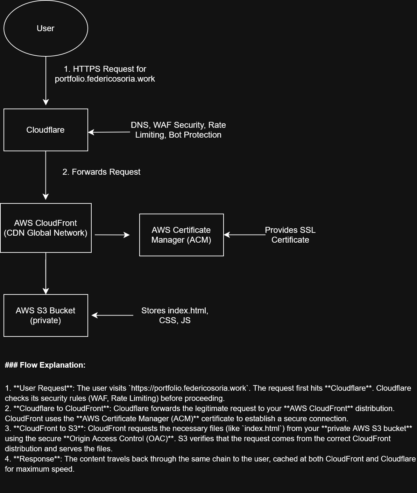

# AWS Infrastructure Documentation

This document details the architecture and configuration of the AWS and Cloudflare services used to deploy the portfolio.

### Architecture Diagram

### Architecture Components

1.  **AWS S3 (Simple Storage Service)**
    * **Role**: Storage for the website's static files (HTML, CSS, JS, images).
    * **Key Configuration**:
        * The bucket is configured to be **100% private**, blocking all direct public access.
        * The bucket policy (see the `policies/` folder) grants read permission (`s3:GetObject`) **only** to the associated CloudFront distribution, using OAC.

2.  **AWS CloudFront**
    * **Role**: Acts as the CDN (Content Delivery Network) and secure entry point for the website.
    * **Key Configuration**:
        * **Origin**: Points to the private S3 bucket, using **Origin Access Control (OAC)** for authentication.
        * **Behavior**: Redirects all `HTTP` traffic to `HTTPS` to ensure a secure connection.
        * **Domain**: Configured with a CNAME (`portfolio.federicosoria.work`) and a valid SSL certificate.
        * **Root Object**: `index.html` has been set as the default root object.

3.  **AWS Certificate Manager (ACM)**
    * **Role**: Provides the free SSL/TLS certificate that enables `HTTPS` connections through CloudFront.
    * **Configuration**: The certificate was validated via DNS by adding a CNAME record in Cloudflare.

4.  **Cloudflare**
    * **Role**: Manages the domain's DNS and provides an edge security layer.
    * **Configuration**:
        * A **CNAME** record points `portfolio.federicosoria.work` to the CloudFront distribution's URL.
        * The **proxy mode (orange cloud)** is enabled to use Cloudflare's security features.
        * A **Rate Limiting** rule has been configured to block IPs exceeding 100 requests per minute.
        * The **"Bot Fight Mode"** has been enabled to mitigate malicious automated traffic.

# Documentación de la Infraestructura en AWS

Este documento detalla la arquitectura y configuración de los servicios de AWS y Cloudflare utilizados para desplegar el portfolio.

### Diagrama de la Arquitectura

### Componentes de la Arquitectura

1.  **AWS S3 (Simple Storage Service)**
    * **Rol**: Almacenamiento de los archivos estáticos del sitio web (HTML, CSS, JS, imágenes).
    * **Configuración Clave**:
        * El bucket está configurado como **100% privado**, bloqueando todo el acceso público directo.
        * La política del bucket (ver en la carpeta `policies/`) concede permiso de lectura (`s3:GetObject`) **únicamente** a la distribución de CloudFront asociada, utilizando OAC.

2.  **AWS CloudFront**
    * **Rol**: Actúa como CDN (Content Delivery Network) y punto de acceso seguro a la web.
    * **Configuración Clave**:
        * **Origen**: Apunta al bucket de S3 privado, utilizando **Origin Access Control (OAC)** para la autenticación.
        * **Comportamiento**: Redirige todo el tráfico de `HTTP` a `HTTPS` para garantizar una conexión segura.
        * **Dominio**: Configurado con un CNAME (`portfolio.federicosoria.work`) y un certificado SSL válido.
        * **Objeto Raíz**: Se ha establecido `index.html` como el objeto raíz por defecto.

3.  **AWS Certificate Manager (ACM)**
    * **Rol**: Provee el certificado SSL/TLS gratuito que permite las conexiones `HTTPS` a través de CloudFront.
    * **Configuración**: El certificado fue validado mediante DNS, añadiendo un registro CNAME en Cloudflare.

4.  **Cloudflare**
    * **Rol**: Gestiona el DNS del dominio y proporciona una capa de seguridad perimetral.
    * **Configuración**:
        * Un registro **CNAME** apunta `portfolio.federicosoria.work` a la URL de la distribución de CloudFront.
        * El **modo proxy (nube naranja)** está activado para utilizar las funciones de seguridad de Cloudflare.
        * Se ha configurado una **regla de limitación de velocidad (Rate Limiting)** para bloquear IPs que superen las 100 peticiones por minuto.
        * Se ha activado el **"Bot Fight Mode"** para mitigar tráfico automatizado malicioso.
		
